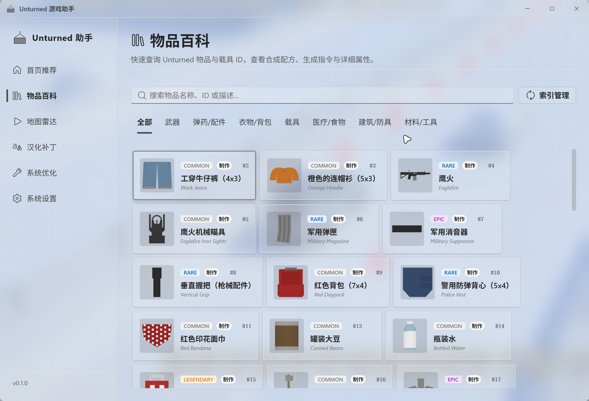
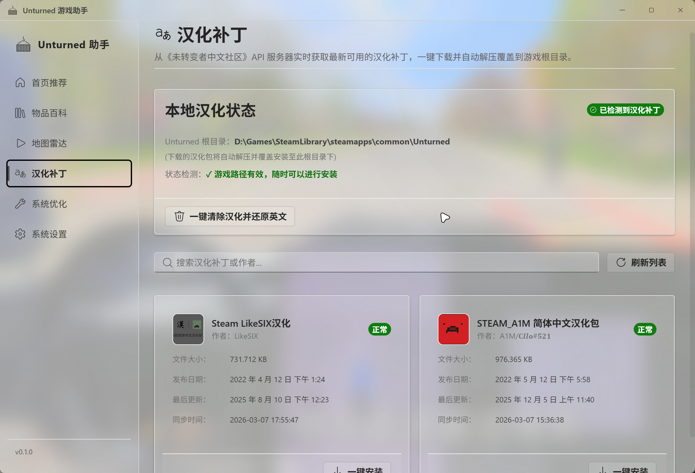

# Unturned Assistant

Unturned Assistant 是一款基于 [Tauri](https://tauri.app/) + [React](https://react.dev/) + [TypeScript](https://www.typescriptlang.org/) 构建的 Unturned 游戏辅助工具。

本软件旨在为 Unturned 玩家提供更便捷的游戏体验，包括但不限于物品 ID 搜索、模组本地化管理、系统性能优化（如 IME 兼容性、分页文件设置）等实用功能。

## 功能概览

- **物品 ID 搜索**：快速查找游戏内物品信息，管理相关索引。
- **模组本地化管理**：轻松解析和管理模组的本地化文件。
- **系统优化**：针对游戏运行环境进行优化，包含 IME 兼容性修复及页面文件管理。

## 功能截图

## 开发者指南

### 环境准备
- 安装 [Bun](https://bun.sh/)
- 安装 [Rust](https://www.rust-lang.org/) (用于 Tauri 后端)

### 推荐 IDE 设置

- [VS Code](https://code.visualstudio.com/) + [Tauri](https://marketplace.visualstudio.com/items?itemName=tauri-apps.tauri-vscode) + [rust-analyzer](https://marketplace.visualstudio.com/items?itemName=rust-lang.rust-analyzer)
